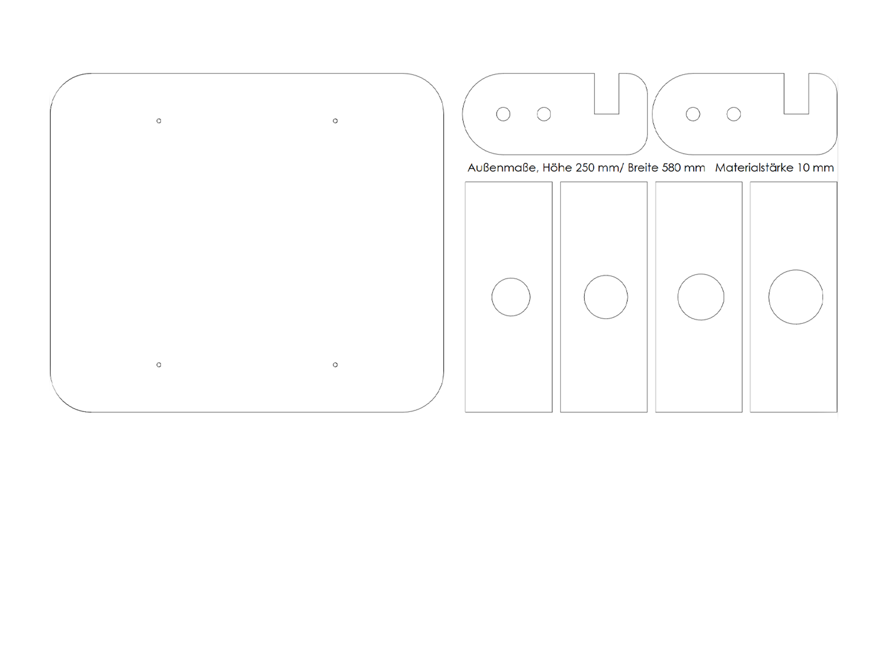
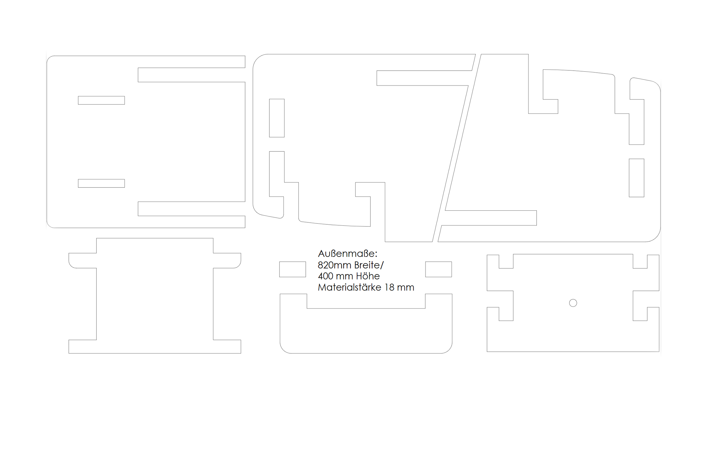

# Anleitung zur Fertigung der einzelnen Bauteile

Hier und im folgenden ist beschrieben wie beim Bau von Vogelhaus "Stecksystem" idealerweise vorgegangen werden kann. Ergänzende Infos und Kaufvorschläge der Materialien sind in der [Materialliste](../Drawings/Materialliste_Stecksystem.pdf) zu finden. Alle Komponenten dieses Vogelhauses lassen sich mit Hilfe eines Industrielasers ausschneiden, sofern dieser eine Materialstärke von 18 mm durch Weichholzarten wie Kiefer oder Fichte bewerkstelligen kann. 

__Fertigung Kunststoffteile__

In dem Ordner "Drawings" befindet sich eine Laservorlage mit dem Namen "Stecksystem_Laservorlage_Kunststoffteile" Alle Kunststoffkomponenten können aus einem einzelnen Werkstück der Mindestgröße 250/580/10 mm gelasert werden. Die Vektorgrafiken können auch separat ausgeschnitten werden, zu beachten ist jedoch die Dicke des Werkstücks von 10 mm (+- 0.5 mm) Alternativ zu Kunststoff können die Teile auch wie im folgenden aus Holz gearbeitet werden. Es sind 4 verschiedene Größen von Einfluglöchern der Frontplatte mit den Maßen 25, 30, 32 und 40 mm für verschiedene Vogelarten in der Grafik angelegt worden.  

Die Laservorlage für die Kunststoffteile findest du hier: [Laservorlage Kunststoffteile](../Drawings/Stecksystem_Laservorlage_Kunststoffteile.svg)

__Fertigung Holzteile__

In dem Ordner "Drawings" befindet sich zudem eine Laservorlage mit dem Namen "Stecksystem_Laservorlage_Holzteile" Alle Holzteile können aus einem einzelnen Werkstück der Mindestgröße 820/400/18 mm gelasert werden. Die Vektorgrafiken können auch separat ausgeschnitten werden, zu beachten ist jedoch die Dicke des Werkstücks von 18 mm (+- 0.5 mm)  
 xxx
Die Laservorlage für die Holzteile findest du hier: [Laservorlage Holzteile](../Drawings/Stecksystem_Laservorlage_Holzteile.svg)

Für den Fall, dass kein Laser zur Bearbeitung der Koponenten zur Verfügung steht oder das nötige Fachwissen nicht vorhanden ist, lassen sich die Teile auch händisch mit anderen Subtraktionsverfahren herstellen. Auch CNC Fräsen ist eine Option. Für diesen Fall wurdem im Ordner "Drawings" technische Zeichnungen mit den Maßen der Komponenten abgelegt. Von diesen Alternativen ist aufgrund der der komplizierten Geometrie der Teile jedoch eher abzuraten.  

