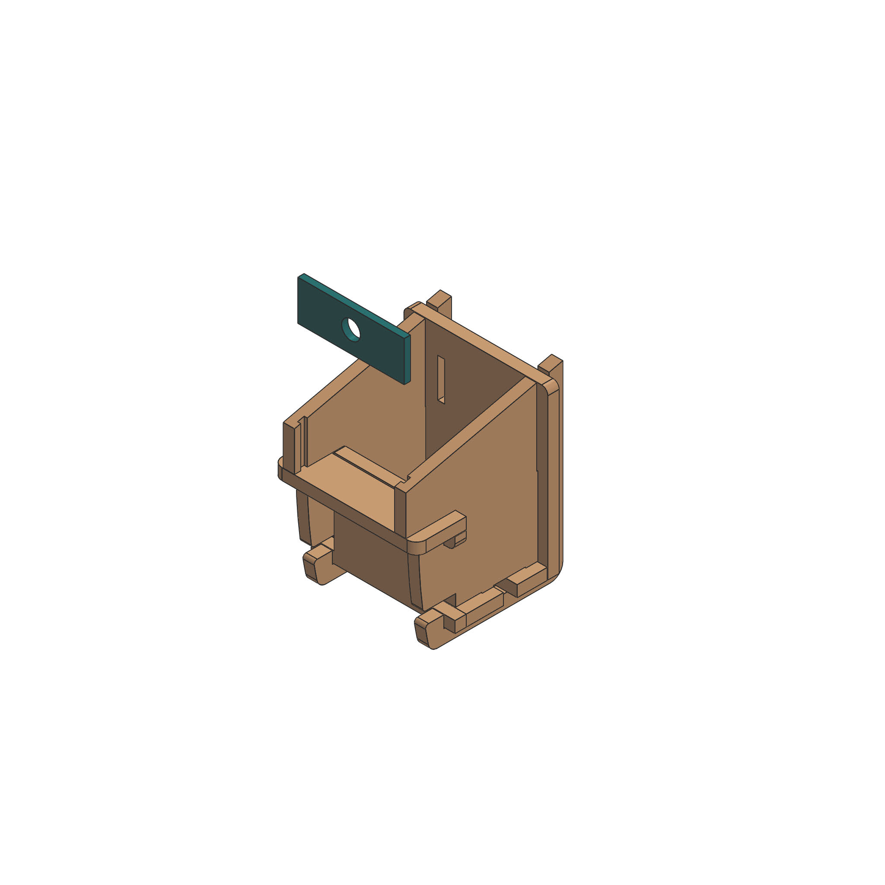
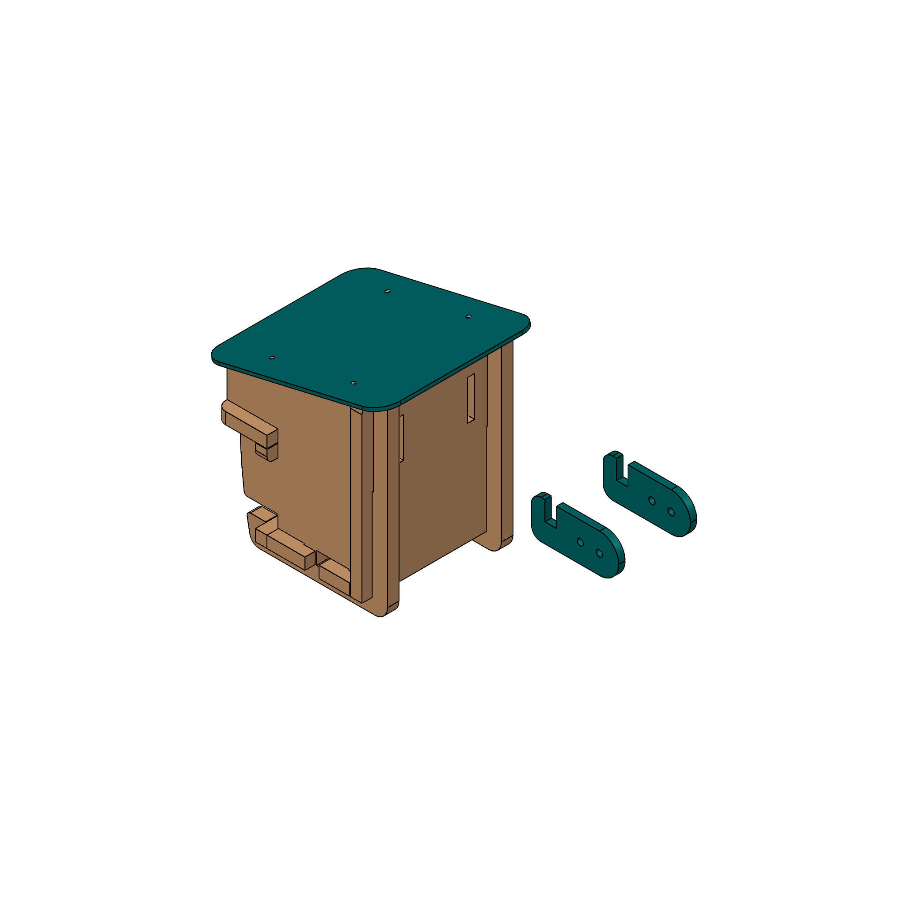

# Aufbauanleitung

Hier findet ihr die Bauanleitung von Vogelhaus "Stecksystem". Achtet darauf, dass ihr alle entsprechenden Einzelteile im Voraus gefertigt habt, bevor ihr versucht die Teile zusammenzusetzen. Die Reihenfolgenach dem folgenden Prinzip ist bindend damit der Zusammenbau einfach und fehlerfrei abläuft. Bei diesem Entwurf ist es besonders wichtig, dass du vorsichtig vorgehst und keine Teile mit Gewalt einfügst, damit beim Holz keine Ecken abbrechen. 

__Benötigte Werkzeuge und Hilfsstoffe für den Zusammenbau__

1. Schraubendreher oder Akkuschrauber
2. Schraubzwingen oder eine helfende Person
3. Schleifpapier (Körnung 80-200) oder Holzpfeilen für Korrekturen oder abschließende Schönheitsarbeiten.

__Schritt 1__ Setze die hölzernen Seitenände mit dem Boden zusammen. Hierfür musst du das Bodenteil nach dem anstecken der Wände nach hinten drücken!

__Schritt 2__ Nun schiebe folgendermaßen von oben die Rückwand ein. 

__Schritt 3__ Anschließend schiebe von vorne die Frontwand in das Gebilde bis zum Anschlag, sodass sie automatisch nach unten einrastet. Gegebenfalls musst du die Vorderwand leicht nach unten drücken.

__Schritt 4__ Nun schiebe frontal den Zwischenboden ein. Alle Holzteile sind nun verbaut. 

__Schritt 5__ Jetzt wird von oben die Frontplatte aus Kunstoff eingeschoben. (Je nachdem für welche Vogelart du dich entscheiden hast)

__Schritt 6__ Abschließend muss nur noch das Dach angeschraubt werden. Verwende hierfür die 4 Schrauben der Größe M3 mit 20-22 mm Länge. 

__Schritt 7__ Hänge nun die Montage-Haken in die Rückwand ein. 

__Fertig__. Nun kann das Vogelhaus aufgehängt werden. Jenachdem für welchen Ort du dich entschieden hast, verwende hierfür jenachdem wofür du dich entschieden hast Kunst- oder
Naturfaser z.B. PE oder PP, je nach Nachhaltigkeit und Langlebigkeit vorausgesetzt hohe Zugfestigkeit und Wetterbeständigkeit. 

__Austausch des Einfluglochs__
Beachte, dass du durch das Hervorziehen des Zwischenbodens die Frontplatte nach unten herausziehen und austauschen kannst ohne das Dach abnehnen zu müssen. Dies ist sinnvoll, wenn du die Einfluglochgröße den angesprochenen Vogelarten anpassen willst.  

__Austausch der Frontplatte__
Auch die Frontplatte lässt sich auf dieses Weise unkompliziert herausnehmen um das Vogelhaus unkompliziert reinigen zu können. 

