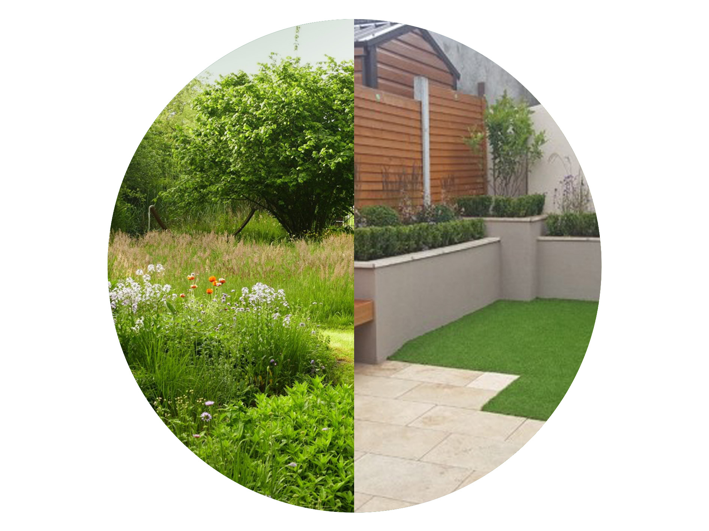
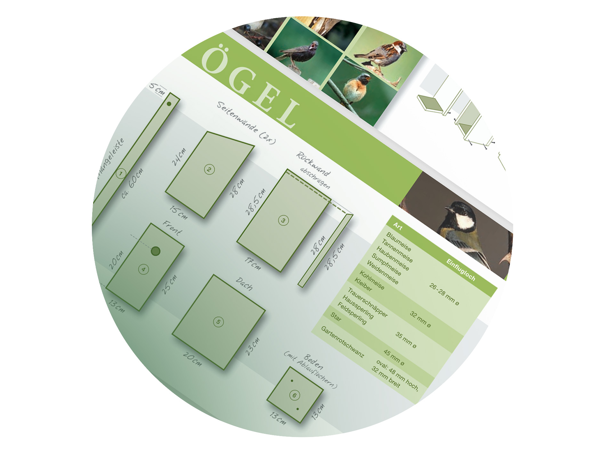
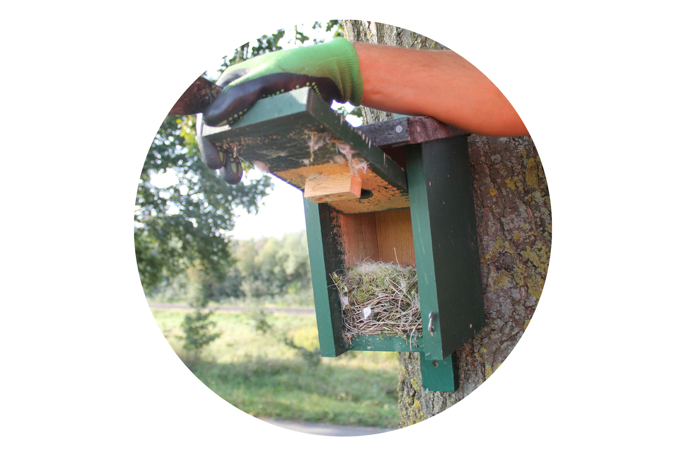
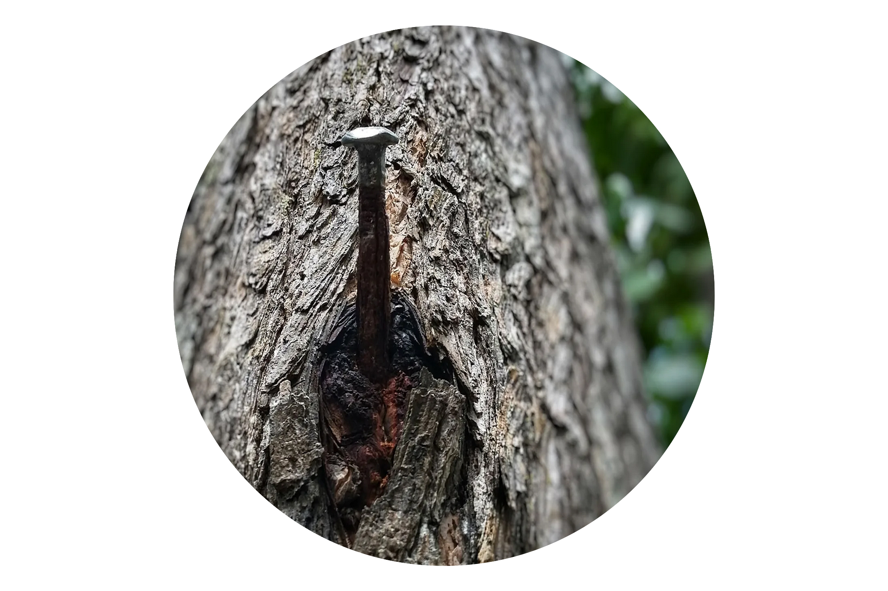
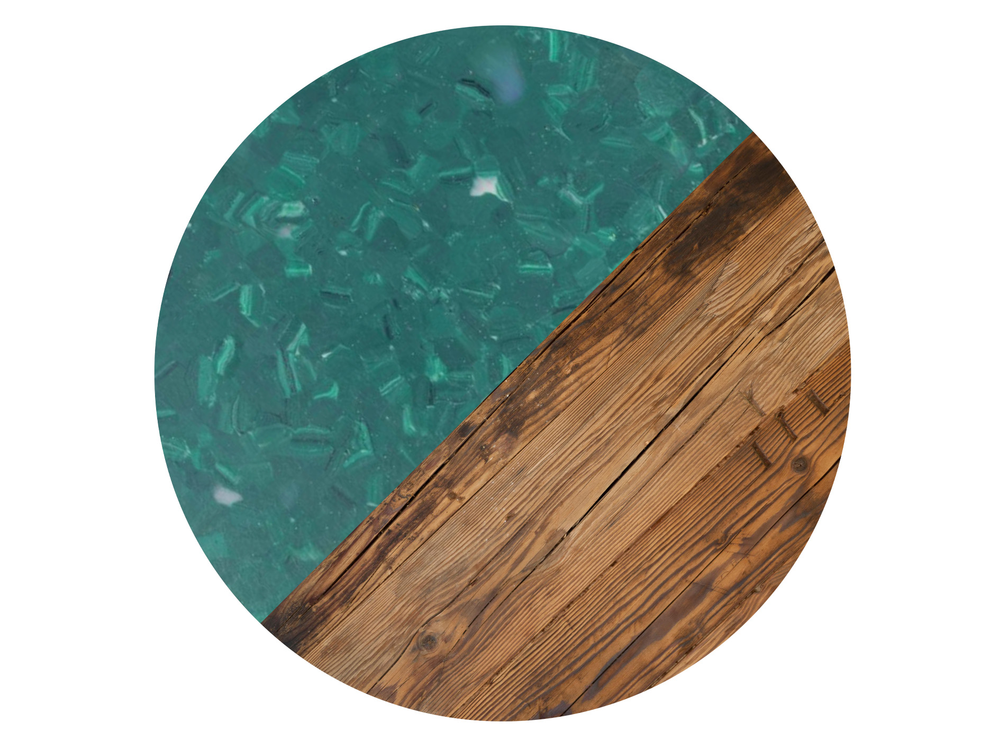

# Checkliste

Unabhängig davon ob ihr eines der Vogelhäuser nachbaut, weiterentwickelt oder einen ganz neuen Entwurf kreiren und aufhängen wollt, gibt es einige wichtige Dinge zu beachten, die für die Umwelt, die Tiere und den Erfolg des Projekts mehr oder weniger wichtig sein können. 
Hier findet ihr eine Übersicht an Checkpunkten an denen wir uns oriententiert haben. 

__Schutz vor Nesträubern__

Viele Tierarten, insbesondere Vögel sind heutzutage stark bedroht. Neben anderen Faktoren sind Nesträuber wie Waschbären, Marder und Hauskatzen dafür verantwortwortlich. Um zu verhindern, dass diese Tiere die Brut der Singvögel bedrohen gibt es bewährte Maßnahmen:

1. Gestalte die Einflugöffnung gerade so groß, dass nur der Nistvogel und vergleichbargroße Arten durchpassen.
2. Baue einen vorgezogenen Zwischenboden in das Vogelhaus, (so wie wir es z.B. bei den Vogelhäusern "Stecksystem" und "Oskar" gemacht haben).
   In dieser Form haben die Räuber Schwierigkeiten bis zur Brut hinunter zu greifen. 
4. Bringe den Vogelkasten idealerweise in einer Höhe von mindestens 2 Metern an, sodass es manchen Räubern schwerer fällt die Brut zu wittern und 
diese zu erreichen.

__Der passende Ort__

Achte zudem darauf, dass du für dein Vogelhaus einen geeigneten Ort findest, wo sich die Tiere natürlicherweise wohl fühlen. 
Es sollte dort möglichst viel unterschiedliche Vegetation geben, die für viele Lebewesen einen Rückzugsort zum Verstecken und eine wichtige Nahrungsgrundlage bietet. Nur in einem gesunden Ökosystem siedeln sich auch Vögel an um dort zu brüten. Ich denke es sollte klar sein welches der beiden folgenden Beispiele auf dem Bild geeigneter ist.  

__Die richtigen Maße__

Unter dem folgenden Link https://www.nabu-rlp-sued.de/artenschutz/bauanleitungen-f%C3%BCr-nisthilfen/ 
des Nabu Rheinland Pfalz findet ihr viele Infos zu dem Thema, auch die Maße für Vogelhäuser, welche sich etabliert haben um möglichst viele Vogelarten zu erreichen, indem sie gerade groß genug sind und entsprechend Material sparen. Es reicht aber wenn sie euch als ungefährer Anhaltspunkt dienen. 

__Reinigung des Nistkastens__

Leider müssen Nistkästen ein mal im Jahr nach der Brutsaison gereinigt werden, damit sie sich nicht mit Nistmaterial anfüllen und irgendwann nicht mehr bezogen werden. Gestalte den Kasten also idealerweise so, dass er sich unkompliziert öffnen und reinigen lässt. Die Brutsaison der meisten Singvögel ist im Frühsommer von Mai bis Juli. Ab August lohnt sich der erste Blick ins Innere ob der Mieter mitlerweile ausgezogen ist. 

__Die ideale Befestigung__

Einfache Eisen- oder Kupfernägel können für einige Baumarten problematisch sein, da sie für diese in einigen Fällen gesundheitsschädlich sind und der Pflanze schaden. Zudem gehen Werkzeuge wie Kettensägen beim Fällen der Bäume kaputt wenn sie in hartes Metall sägen. Um dies zu verhindern ist es ratsam Aluminium-Nägel zu verweden.   

__Geeignetes Material__

Die Materialwahl der Tierbehausung ist gleich aus mehreren Gründen besonders wichtig. Beachte dabei bitte folgende Punkte: 

1. Das Material sollte möglichst atmungsaktiv sein, denn wenn das Innere des Hauses mal nass wird und nicht richtig trocknet, kann sich Schimmel bilden, es setzen Fäulnisprozesse ein und Parasiten haben bei den Nestlingen leichteres Spiel. Das schadet der Gesundheit der Brut und verkürzt zudem die Langlebigkeit der Behausung.
2. Achte darauf, dass die verwendeten Materialien nicht vorbehandelt oder beschichtet wurden. In vielen Fällen verstecken sich giftige und umweltschädliche Chemikalien in und auf wiederverwerteten Gegenständen.
3. Denke an die Nachhaltigkeit deiner Materialien. Nachhaltig ist ein Material z.B. dann, wenn es sich mit der Zeit durch die äußeren Einflüsse natürlich zersetzt und komplett wieder in den biologischen Stoffkreislauf zurückgeführt werden kann. Versuche zudem möglichst keine neuen Materialien zu verwenden, sondern bereits existierende Werkstoffe neu aufzubereiten und wiederzuverwenden. Das klappt nicht immer, aber in vielen Fällen. Auch recycelter Kunststoff ist in eingen Fällen deutlich nachhaltiger als manche anderen Alternativen. Bspw. unsere Dächer bestehen aus wasserabweisendem Kunststoff um die Lebensdauer der Behausungen zu verlängern. 

Wenn du möglichst viele dieser Punkte beachtest, hast du in deinem Vorhaben schon halb gewonnen.

__Viel Spaß bei der Umsetzung!__ 

